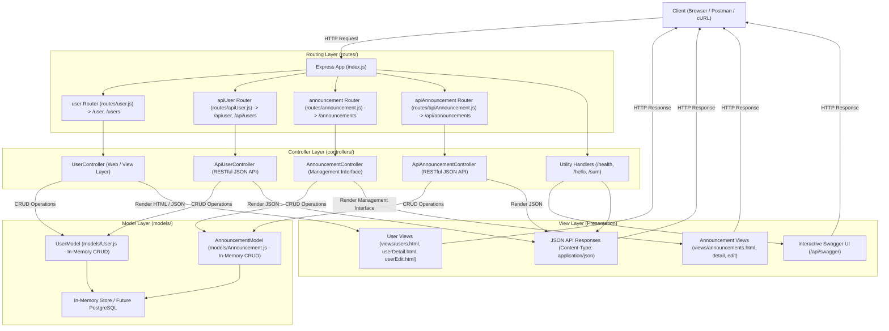

# Alumni

A simple alumni tracking application designed to organize, search, and manage alumni profiles and records.

---

## 💻 Tech Stack & Languages

This application uses JavaScript across the full stack alongside a relational database:

- **Frontend — JavaScript**
  - **Role:** Client-side interface & user interaction.
  - **Specifics:** Powers dynamic UI rendering, DOM manipulation, form inputs/validations, and asynchronous API calls (`fetch`/`axios`) to search, filter, and display alumni profiles without full page reloads.

- **Backend — Node.js (JavaScript)**
  - **Role:** Server-side runtime environment & REST API.
  - **Specifics:** Manages server logic, routing, request parsing, authentication, business rules, and secure communication with the PostgreSQL database.

- **Database — PostgreSQL (SQL)**
  - **Role:** Relational database management system (RDBMS).
  - **Specifics:** Uses Structured Query Language (SQL) for schema definitions, data integrity constraints (primary/foreign keys), indexing, and executing transactional queries to reliably persist alumni records (e.g., graduation year, department, contact info, and employment history).

---

## 🏛️ MVC (Model-View-Controller) Architecture

This application is architected according to the **Model-View-Controller (MVC)** design pattern with dedicated Routing and Controller layers, promoting clean separation of concerns, testability, and modularity:



### 1. 🚦 Routing Layer (`routes/`)
Routes decouple endpoint paths and HTTP verbs from business logic:
- **`routes/user.js`**: Defines routes for user web views (`/user`, `/users`) with full **View Layer** CRUD support, bound to [`UserController`](./controllers/UserController.js):
  - **`GET /users`** ➔ `UserController.getAll`: Renders Alumni Directory with CRUD table.
  - **`POST /users`** ➔ `UserController.create`: Creates user and redirects with flash feedback.
  - `GET /:id` ➔ `UserController.getById`: Renders alumni profile card view.
  - `GET /:id/edit` ➔ `UserController.getEditForm`: Renders alumni edit form view.
  - `POST /:id/edit` / `PUT /:id` ➔ `UserController.update`: Updates record and redirects.
  - `POST /:id/delete` / `DELETE /:id` ➔ `UserController.delete`: Deletes record and redirects.
- **`routes/apiUser.js`**: REST API routes (`/apiuser`, `/api/users`) bound to [`ApiUserController`](./controllers/ApiUserController.js).
- **`routes/announcement.js`**: Web management interface routes (`/announcements`) bound to [`AnnouncementController`](./controllers/AnnouncementController.js):
  - **`GET /announcements`** ➔ `AnnouncementController.getAll`: Renders Announcements Management Dashboard with publication form and management table.
  - **`POST /announcements`** ➔ `AnnouncementController.create`: Publishes new announcement and redirects with flash feedback.
  - `GET /:id` ➔ `AnnouncementController.getById`: Renders announcement detail view.
  - `GET /:id/edit` ➔ `AnnouncementController.getEditForm`: Renders announcement edit form.
  - `POST /:id/edit` / `PUT /:id` ➔ `AnnouncementController.update`: Updates announcement.
  - `POST /:id/delete` / `DELETE /:id` ➔ `AnnouncementController.delete`: Removes announcement.
- **`routes/apiAnnouncement.js`**: REST API routes (`/api/announcements`) bound to [`ApiAnnouncementController`](./controllers/ApiAnnouncementController.js).

### 2. ⚙️ Controller Layer (`controllers/`)
The **Controllers** handle incoming requests, invoke Model methods, format responses, and choose the appropriate View:
- **`controllers/ApiUserController.js`**: RESTful JSON responses for alumni user resources.
- **`controllers/UserController.js`**: Web & presentation controller for alumni users via the View Layer.
- **`controllers/ApiAnnouncementController.js`**: RESTful JSON responses for announcements (`GET`, `POST`, `PUT`, `PATCH`, `DELETE`).
- **`controllers/AnnouncementController.js`**: Web controller managing the Announcements dashboard, detail cards, edit forms, and redirects.
- **Utility Controllers (in `index.js`)**: Health status (`/api/health`), greetings (`/hello`), and arithmetic (`/sum`).

### 3. 📦 Model Layer (`models/`)
The **Model** encapsulates domain data and business operations independently of database drivers (in-memory):
- **`models/User.js` (`UserModel`)**: In-memory store with `findAll`, `findById`, `create`, `update`, `delete`.
- **`models/Announcement.js` (`AnnouncementModel`)**: In-memory store for announcements (`id`, `title`, `content`, `category`, `author`, `date`) with complete CRUD functions (`findAll`, `findById`, `create`, `update`, `delete`).

### 4. 🖥️ View Layer (`views/` & Presentation)
The **View Layer** presents information with clean separation from controllers:
- **User Views**:
  - `views/users.html`: Alumni Directory table with View/Edit/Delete actions and creation form.
  - `views/userDetail.html`: Alumni profile card view.
  - `views/userEdit.html`: Pre-filled alumni edit form view.
  - `views/UserView.js`: View rendering helper for user templates.
- **Announcement Management Interface**:
  - `views/announcements.html`: Management dashboard table and announcement creation form.
  - `views/announcementDetail.html`: Full announcement detail card.
  - `views/announcementEdit.html`: Announcement edit form view.
  - `views/AnnouncementView.js`: View rendering helper for announcement templates.
- **Static HTML Pages**: Stored in `public/` ([`index.html`](./public/index.html), [`about.html`](./public/about.html)).
- **Interactive Documentation UI**: Swagger UI served at `/api/swagger` and OpenAPI JSON at `/api/swagger.json`.
- **JSON REST Representations**: API responses returned with `Content-Type: application/json`.

---

## 🚀 Getting Started

### Prerequisites

- [Docker](https://docs.docker.com/get-docker/)
- [Docker Compose](https://docs.docker.com/compose/)
- [Node.js](https://nodejs.org/) (v18+)

### Running Locally with Node.js

1. **Install dependencies:**
   ```bash
   npm install
   ```

2. **Start the server:**
   ```bash
   npm start
   ```

3. **Verify the server:**
   Open [http://localhost:3000](http://localhost:3000) or run:
   ```bash
   curl http://localhost:3000/
   # Output: Temporary Home Page (HTML)

   curl http://localhost:3000/about
   # Output: About Page (HTML)

   curl http://localhost:3000/api/health
   # Output: {"status":"ok"}

   curl http://localhost:3000/api/swagger
   # Output: Swagger UI (HTML)

   curl http://localhost:3000/api/users
   # Output: [{"id":1,"name":"Hakan Ural",...}]

   curl http://localhost:3000/hello
   # Output: Hello World

   curl http://localhost:3000/hello/hakan
   # Output: Hello Hakan!

   curl http://localhost:3000/sum/3/5
   # Output: toplam= 8
   ```

---

## 📖 API Documentation (Swagger)

All available REST API endpoints are documented with interactive Swagger UI:

- **Swagger UI URL:** [http://localhost:3000/api/swagger](http://localhost:3000/api/swagger)
- **OpenAPI 3.0 Specification (JSON):** [http://localhost:3000/api/swagger.json](http://localhost:3000/api/swagger.json)

> ⚠️ **ÖNEMLİ: Swagger Sürekli Güncellenmelidir (Swagger Maintenance Rule)**  
> Bu projeye eklenen veya güncellenen her yeni API route'u, parametreleri, gövdesi (request body) ve yanıt formatı için **Swagger dokümantasyonu (`swagger.json` / `/api/swagger`) sürekli ve eşzamanlı olarak güncellenmelidir**. Yapılan her API geliştirmesinde Swagger dokümantasyonunun güncel tutulması zorunludur.

### Running with Docker Compose

1. **Clone the repository and navigate to the project directory:**
   ```bash
   git clone https://github.com/HakanURAL06/alumni.git
   cd alumni
   ```

2. **Start the services:**
   Run the following command to build and spin up all containers (frontend, backend, database):
   ```bash
   docker compose up
   ```

   *Optional flags:*
   - **Run in the background (detached mode):**
     ```bash
     docker compose up -d
     ```
   - **Rebuild images before starting:**
     ```bash
     docker compose up --build
     ```

3. **Stop the services:**
   To stop and tear down running containers:
   ```bash
   docker compose down
   ```
